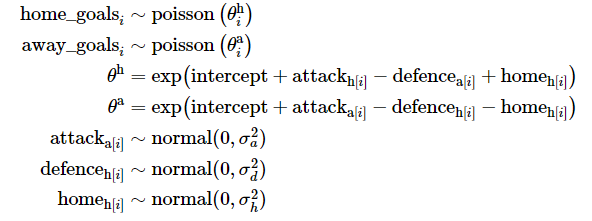

<!-- README.md is generated from README.Rmd. Please edit that file -->

# Stan vs TMB for modeling football games

This repository compares the R packages `rstan` (based on the Stan
language) and `TMB` for modeling of football results. The goal of this
repository is to show that`TMB` and Stan produces very similar
inference, but `TMB` can do it at a fraction of the computational cost.
The model is taken from Tommy Odland’s great [blogg
post](https://tommyodland.com/articles/2022/the-2022-norwegian-football-elite-series/).

Stan is a state-of-the-art platform for statistical modeling and
high-performance statistical computation. It has become the go-to tool
for Bayesian modeling. The R package `TMB` (Template Model Builder) is a
frequentist alternative that performs maximum likelihood estimation
where latent variables are integrated out of the likelihood using the
Laplace approximation. Both `rstan` and `TMB` use automatic
differentiation (AD) for accurate evaluation of derivatives.

The file `poisson_goals_model.stan` and `poisson_goals_model.cpp`
contains the Stan and `TMB` code, respectively. If you want to reproduce
the simulation study, you can run the `simulation_study.R` script.

## Model

The number of goals scored by the home and away team in a match is
modeled as a hierarchical model on the form:
<!-- <!-- -->

<!-- $$ -->
<!-- \begin{align} -->
<!-- \text{home_goals}_i &\sim \text{poisson} \left( \theta^\text{h}_i \right) \\ -->
<!-- \text{away_goals}_i &\sim \text{poisson} \left( \theta^\text{a}_i \right) \\ -->
<!-- \theta^\text{h} &= \exp \left( \text{intercept} + \text{attack}_{\text{h}[i]} - \text{defence}_{\text{a}[i]} + \text{home}_{\text{h}[i]} \right) \\ -->
<!-- \theta^\text{a} &= \exp \left( \text{intercept} + -->
<!-- \text{attack}_{\text{a}[i]} - \text{defence}_{\text{h}[i]} - \text{home}_{\text{h}[i]} \right) \\ -->
<!-- \text{attack}_{\text{a}[i]} &\sim \text{normal}(0, \sigma_a^2) \\ -->
<!-- \text{defence}_{\text{h}[i]} &\sim \text{normal}(0, \sigma_d^2) \\ -->
<!-- \text{home}_{\text{h}[i]} &\sim \text{normal}(0, \sigma_h^2) -->
<!-- \end{align} -->
<!-- $$ -->

The number of home goals is a function of a fixed intercept, the home
teams attack strength minus the defense strength of the away time, and a
home advantage effect. The attach, defense and home advantage effect are
all random effects with normally distributed priors with unknown
variance.

For the Stan model we also have appropriate priors for the intercept and
the variance of the random effects. The Stan model runs four chain of
2000 samples, where the first 1000 is used as warmup, giving us 4000
samples from the posterior distribution.

## Run time

The table below shows the run time for TMB and STAN for different number
of observations (games). For smaller datasets TMB is about 100 times
faster and for the biggest dataset of 30400 games it is about 500 times
faster. In other words, a substantial speed up! This should not come as
a surprise as the MCMC algorithm has to evaluate the posterior and it’s
gradient for each sample, while TMB uses optimization to find parameter
estimates, leading to a lot fewer evaluations of the likelihood.

| n_games | TMB |   Stan | relative_time |
|--------:|----:|-------:|--------------:|
|    1900 | 0.7 |   75.5 |         107.0 |
|    3800 | 1.1 |  214.8 |         201.0 |
|    7600 | 1.8 |  623.2 |         348.9 |
|   15200 | 3.9 | 1437.7 |         366.5 |
|   30400 | 7.5 | 3777.3 |         503.5 |

The figures below shows the run time as a function of number of games.

<!-- -->

## Parameter estimates

The figure below show the parameter estimates for the attach, defense
and home effect for each team. The top figure uses 1900 games as its
training data, while the bottom uses 30400 games. The results are very
similar and show that for this model, the normal approximation of the
posterior is indeed a very good approximation (the standard deviation
for the normal approximation is calculated by taking the square root of
the diagonal of the inverse hessian of the negative log-likelihood at
the parameter estimates). The small differences we observe are probably
a result of the priors we use in Stan, which are not used in `TMB` (but
could easily be included, giving us a penalized likelihood).

<!-- -->
