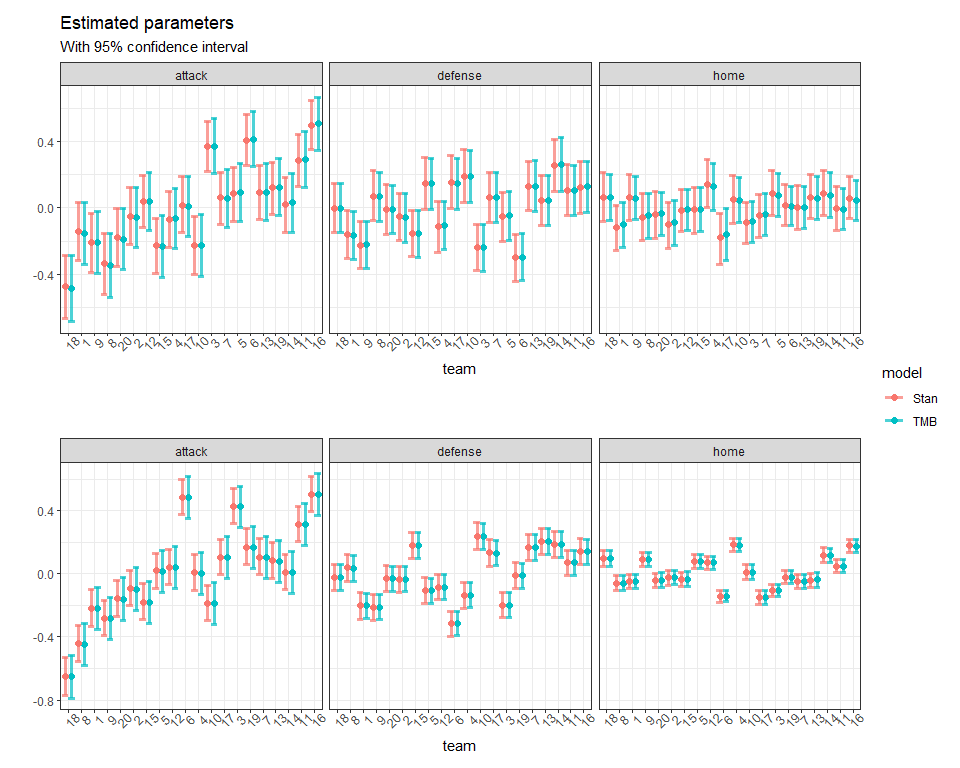

<!-- README.md is generated from README.Rmd. Please edit that file -->

# FootballStanVsTMB

This repository compares Stan and TMB for modeling of football results.
The model is taken from Tommy Odland’s [blogg
post](https://tommyodland.com/articles/2022/the-2022-norwegian-football-elite-series/).

Stan is a state-of-the-art platform for statistical modeling and
high-performance statistical computation. It has become the go-to tool
for Bayesian modeling. The R package TMB (Template Model Builder) is a
frequentist alternative that performs maximum likelihood estimation
where latent variables are integrated out of the likelihood using the
Laplace approximation. Both Stan and TMB use automatic differentiation
(AD) for accurate evaluation of derivatives.

## Model

The number of goals scored by the home and away team in a match is
modeled as a hierarchical model on the form:

$$
\begin{aligned}
\text{home_goals}_i &\sim \text{poisson} \left( \theta^\text{h}_i \right) \\
\text{away_goals}_i &\sim \text{poisson} \left( \theta^\text{a}_i \right) \\
\theta^\text{h} &= \exp \left( \text{intercept} + \text{attack}_{\text{h}[i]} - \text{defence}_{\text{a}[i]} + \text{home}_{\text{h}[i]} \right) \\
\theta^\text{a} &= \exp \left( \text{intercept} +
\text{attack}_{\text{a}[i]} - \text{defence}_{\text{h}[i]} - \text{home}_{\text{h}[i]} \right) \\
\text{attack}_{\text{a}[i]} &\sim \text{normal}(0, \sigma_a^2) \\
\text{defence}_{\text{h}[i]} &\sim \text{normal}(0, \sigma_d^2) \\
\text{home}_{\text{h}[i]} &\sim \text{normal}(0, \sigma_h^2)
\end{aligned}
$$

The number of home goals is a function of a fixed intercept, the home
teams attack strength minus the defense strength of the away time, and a
home advantage effect. The attach, defense and home advantage effect are
all random effects with normally distributed priors with unknown
variance.

For the Stan model we also have appropriate priors for the intercept and
the variance of the random effects. The Stan model runs four chain of
2000 samples, where the first 1000 is used as warmup, giving us 4000
samples from the posterior distribution.

## Run time

The table below shows the run time for TMB and STAN for different number
of observations (games). For smaller datasets TMB is about 100 times
faster and for the biggest dataset of 30400 games it is about 500 times
faster. In other words, a substantial speed up! This should not come as
a surprise as the MCMC algorithm has to evaluate the posterior and it’s
gradient for each sample, while TMB uses optimization to find parameter
estimates, leading to a lot fewer evaluations of the likelihood.

| n_games | TMB |   Stan | relative_time |
|--------:|----:|-------:|--------------:|
|    1900 | 0.7 |   75.5 |         107.0 |
|    3800 | 1.1 |  214.8 |         201.0 |
|    7600 | 1.8 |  623.2 |         348.9 |
|   15200 | 3.9 | 1437.7 |         366.5 |
|   30400 | 7.5 | 3777.3 |         503.5 |

The figures below shows the run time as a function of number of games.

``` r
p1 = ggplot(dt_plot, aes(n_games, Runtime, color = Model)) +
  geom_point(size = 2.5) +
  geom_line(linewidth = 0.8) + 
  scale_y_log10() + 
  xlab("Number of games") + 
  ggtitle("Runtime in seconds on log-scale")
ggsave(paste0(fig_dir, "runtime.pdf"), plot = p1, width = 12, height = 8, units = "cm")

p2 = ggplot(dt_time, aes(n_games, relative_time)) +
  geom_point(size = 2.5) + 
  geom_line(linewidth = 0.8) + 
  xlab("Number of games") + 
  ylab("Stan / TMB") + 
  ggtitle("Relative runtime")
ggsave(paste0(fig_dir, "relative_runtime.pdf"), plot = p2, width = 12, height = 8, units = "cm")

p1 + p2
```

<!-- -->

## Parameter estimates

``` r


# Compare parameter estimates
plots = list()
for (i in c(1, 5)) {
  dt_tmb = extract_params_tmb(res[[i]]$tmb$obj)
  dt_stan = extract_params_stan(res[[i]]$stan$fit)  
  dt_tmb[, model := "TMB"]
  dt_stan[, model := "Stan"]
  keep = names(dt_tmb)
  dt_comb = rbindlist(list(dt_tmb, dt_stan[, ..keep]))
  
  plots[[paste(i)]] = 
  ggplot(dt_comb, aes(reorder(index, estimate), estimate, color = model)) + 
    facet_wrap(vars(param)) + 
    geom_point(size = 2, position=position_dodge(width=1)) + 
    geom_errorbar(aes(ymin = param_lower, ymax = param_upper),
                  width = 1, 
                  linewidth = 1.2,
                  position=position_dodge(width = 1),
                  alpha = 0.7) + 
    xlab("team") + 
    ylab("") + 
    ggtitle("Estimated parameters", subtitle = "With 95% confidence interval")  
}
#> Constructing atomic D_lgamma
#> iter: 1  Constructing atomic D_lgamma
#> mgc: 4.52971e-14 
#> Constructing atomic D_lgamma
#> Optimizing tape... Done
#> Matching hessian patterns... Done
#> outer mgc:  0.0001067846 
#> iter: 1  value: 5384.065 mgc: 0.4109207 ustep: 1 
#> iter: 2  value: 5384.065 mgc: 0.0001954603 ustep: 1 
#> iter: 3  mgc: 4.431033e-11 
#> outer mgc:  0.1946196 
#> iter: 1  value: 5384.067 mgc: 0.41051 ustep: 1 
#> iter: 2  value: 5384.067 mgc: 0.0001955684 ustep: 1 
#> iter: 3  mgc: 4.432543e-11 
#> outer mgc:  0.1948328 
#> iter: 1  value: 5384.067 mgc: 0.01455482 ustep: 1 
#> iter: 2  value: 5384.067 mgc: 5.475227e-07 ustep: 1 
#> mgc: 4.440892e-14 
#> outer mgc:  0.03436617 
#> iter: 1  value: 5384.064 mgc: 0.01458396 ustep: 1 
#> iter: 2  value: 5384.064 mgc: 5.493267e-07 ustep: 1 
#> mgc: 3.091971e-14 
#> outer mgc:  0.03441749 
#> iter: 1  value: 5384.069 mgc: 0.02072551 ustep: 1 
#> iter: 2  value: 5384.069 mgc: 6.509188e-07 ustep: 1 
#> mgc: 2.930989e-14 
#> outer mgc:  0.02815971 
#> iter: 1  value: 5384.062 mgc: 0.020767 ustep: 1 
#> iter: 2  value: 5384.062 mgc: 6.526409e-07 ustep: 1 
#> mgc: 4.263256e-14 
#> outer mgc:  0.0281801 
#> iter: 1  value: 5384.075 mgc: 0.03488016 ustep: 1 
#> iter: 2  value: 5384.075 mgc: 7.164478e-07 ustep: 1 
#> mgc: 2.930989e-14 
#> outer mgc:  0.01135002 
#> iter: 1  value: 5384.057 mgc: 0.03494999 ustep: 1 
#> iter: 2  value: 5384.057 mgc: 7.166058e-07 ustep: 1 
#> mgc: 5.240253e-14 
#> outer mgc:  0.0112905 
#> outer mgc:  0.2639318 
#> iter: 1  mgc: 1.018741e-12 
#> Optimizing tape... Done
#> Matching hessian patterns... Done
#> outer mgc:  0.005776332 
#> iter: 1  value: 86661.24 mgc: 6.920587 ustep: 1 
#> iter: 2  value: 86661.24 mgc: 0.003448493 ustep: 1 
#> iter: 3  mgc: 8.582575e-10 
#> outer mgc:  0.178744 
#> iter: 1  value: 86661.24 mgc: 6.913669 ustep: 1 
#> iter: 2  value: 86661.24 mgc: 0.003450772 ustep: 1 
#> iter: 3  mgc: 8.593952e-10 
#> outer mgc:  0.178321 
#> iter: 1  value: 86661.24 mgc: 0.01529033 ustep: 1 
#> iter: 2  value: 86661.24 mgc: 6.299559e-08 ustep: 1 
#> mgc: 1.07292e-12 
#> outer mgc:  0.04176905 
#> iter: 1  value: 86661.24 mgc: 0.01532095 ustep: 1 
#> iter: 2  value: 86661.24 mgc: 6.324519e-08 ustep: 1 
#> mgc: 1.352807e-12 
#> outer mgc:  0.03718829 
#> iter: 1  value: 86661.24 mgc: 0.02378235 ustep: 1 
#> iter: 2  value: 86661.24 mgc: 6.583696e-08 ustep: 1 
#> mgc: 1.06648e-12 
#> outer mgc:  0.043485 
#> iter: 1  value: 86661.24 mgc: 0.02382996 ustep: 1 
#> iter: 2  value: 86661.24 mgc: 6.609415e-08 ustep: 1 
#> mgc: 1.389583e-12 
#> outer mgc:  0.03200251 
#> iter: 1  value: 86661.24 mgc: 0.03922773 ustep: 1 
#> iter: 2  value: 86661.24 mgc: 2.597358e-07 ustep: 0.008923143 
#> mgc: 5.086265e-09 
#> outer mgc:  0.03443198 
#> iter: 1  value: 86661.24 mgc: 0.03930627 ustep: 1 
#> iter: 2  value: 86661.24 mgc: 2.606784e-07 ustep: 1 
#> mgc: 1.565859e-12 
#> outer mgc:  0.03752605 
#> outer mgc:  0.2921375

plots[["1"]] / (plots[["5"]] + ggtitle("", subtitle = "")) +  plot_layout(guides = "collect") 
```

<!-- -->

``` r
# ggsave(paste0(fig_dir, "param_estimates.pdf"), width = 12, height = 8, units = "cm")
```
